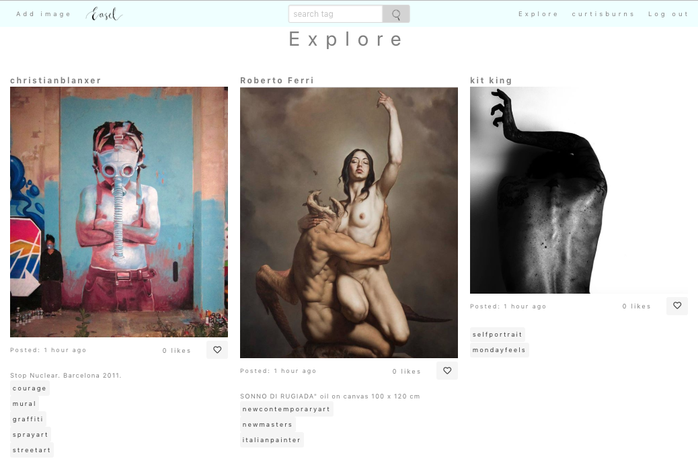

# Easel - Social Art Collective

 

  

[Visit the Easel app on Heroku](http://bit.ly/EaselSAC)

[View the Easel app on GitHub](https://github.com/curtisburns/wdi-project-two)
## Overview

For our second project, we had the option to either do a restaurant review site,
blogging site, or an instagram clone. Easel is an instagram style site that
gives artists to ability to showcase their art within a clean, minimalistic
user interface.
___
# Technologies used:

* HTML
* CSS
* Bulma
* JavaScript
* Node.js
* Express.js
* MongoDB
* EJS
* GitHub
* Git
___
# APIs used

* Filestack
___

# Wireframes

## Home
 
 

  

## Registration

  

## Login

  

## Index

  

## Followers

  

## New Image

  

## New Comments

  

___
# Screenshots

## Explore page

  

## Filestack demo for add image

  

## Navbar/burger menu - mobile

  

  

## Search results page

  

## Image show page

  

## User profile page

  

## User followers page

  

___
# Approach taken

When starting the project, my plan was to input as much functionality as possible to bring it close to how the instagram app worked before I began styling. Having tried to fit in as much functionality as possible using technologies we had only used for a week within 6 days meant that I was pushed for time when styling, and this meant that I could not fully translate what I envisioned into the app. If I could do this again, I would focus on the most important functions like following, likes and not things like date posted etc. Then I would style throughout the development process as it is quite vital in this case.  
___
# Wins

Mi biggest win would be the integration of the Filestack API. Having gone through sorting out an account to actually implementing this to my app, something we had not learnt how to do in class at this point in time, and then seeing it working was a triumph.

Another win for me was the realisation that, while nowhere near as solid or functional, I had built something that resembled the instagram app which is widely used across the world. I could even repurpose my app so that it could be something close family could use.
___
# Blockers

My main blocker was getting used to Bulma. While I had used it before only briefly, I could not use it confidently as I thought it quite restrictive when applying your own styling. Towards the end of the project where I had yet to do styling, I thought that as Bulma can speed up the process I could use this. My mistake was that because I wasn't confident with using it and the lack of planning around my page structure coupled up with the fact the Bulma is very 'div' intensive at times, most of my time was spent trying to figure out why my pages weren't structuring themselves in the way I thought. Even now at the time of writing this, there is a bug on the image-show page where an invisible section covers the bottom half of the page, restricting access for the user to like the image or click on any tags. I feel I'll have to rebuild the page from scratch in order to understand what has gone wrong.
___
# Future features

Here is a list of where I would take this project in the future:

  * Fix the bugs! e.g Image-show page
  * Finish styling
  * Make this fully mobile and tablet responsive
  * Add progressive loading of images
  * Add ability to build your own collections
  * As an artist, add page for a specific exhibition happening soon with google maps API embedded.
  * Carousel for images
  * See posts you've liked
  * Fix it so users who have not logged in can see the explore page
  * Option to add music to your profile to set tone for users who visit your page
  * Option to change background image or colour for your profile.
  * Add admin so they have the ability to add/remove certain images/users.
